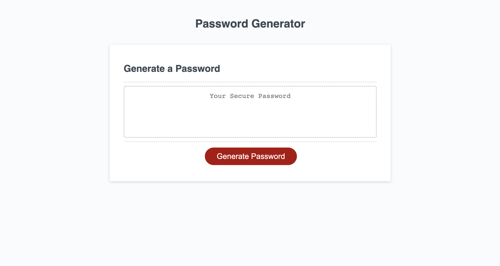

# Password-Generator

## Table of Contents

* [ Description ](#description)
* [ Application Preview ](#application-preview)
* [ Usage ](#usage)
* [ Technologies ](#technologies)
* [ Contributor ](#contributor-🙌)
* [ License ]()

## Description

This site is a random password generator that will generate a password with the criteria that the user selects through the window prompts.

## Application Preview

## Usage

Click the generate password button and answer the window prompts that appear on the screen. When the window prompts finish, the password will appear that meat the criteria that you selected.

## Technologies

* JavaScript
* HTML
* CSS

## Contributor 🙌

**Maya Morales** - [LinkedIn](https://www.linkedin.com/in/maya-morales-1191351bb/) - [GitHub](https://github.com/mayaimorales) - [Email](mayainomorales@gmail.com)

I am an aspiring full-stack developer. Please feel free to contact me with any questions, critiques, or other inquiries.

## License

